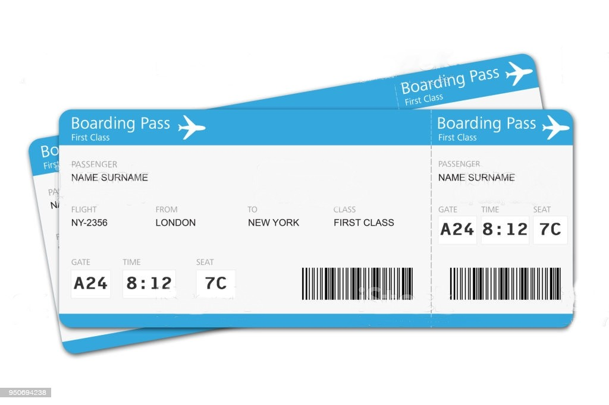

# Click Travel

**Sujet** : Récupérer un billet d'avion pour aller à la destination de vos rêves


# Partie 1 (1h)

- Forker le repository Github du front end : https://github.com/bratosab/click-travel-ng
- Installer les dépendances npm et lancer le projet (Infos à la fin du readme)
- Récupérer et afficher les destinations de rêve par les destinations de rêve de l'API, pour se faire :
  1. Créer un service `click-travel` et l'injecter dans app en précisant dans le décorateur `providedIn: 'root'`,
  2. Créer une méthode pour récupérer les données de l'API `https://travel-api.clicksomeone.com/destinations` - [Swagger de l'API](https://travel-api.clicksomeone.com/explorer/#/DestinationController/DestinationController.find),
  3. Implémenter l'appel de cette méthode dans le composant `AppComponent` et filtrer par les destinations de rêves (`isDreamDestination: true`), de préférence avec du [**RxJS**](https://www.learnrxjs.io/learn-rxjs/operators/filtering/filter),
  4. Remplacer les boutons codés en dur de la home page par les destinations de rêves dynamiques.
- **Comiter** votre code avec le commentaire `feat(home page)`

# Partie 2 (30 minutes)

- Au clic sur un des boutons, naviguer vers une page qui permet d'afficher la liste des billets d'avion pour se rendre à la destination de rêve sélectionnée
- La liste des billets est récupérable sur `https://travel-api.clicksomeone.com/tickets` - [Swagger de l'API](https://travel-api.clicksomeone.com/explorer/#/TicketController/TicketController.find)
  * Cette liste est filtrable en passant un paramètre `filter` en query param, précisant la propriété et la valeur du filtre, example : [Vols pour New York](GET "https://travel-api.clicksomeone.com/tickets?filter=%7B%0A%20%20%22where%22%3A%20%7B%20%22to%22%3A%20%22NYC%22%20%7D%0A%7D") :
    * Valeur de `filter` :
     ```json 
     { "where": { "to": "NYC" } } 
     ```

- **Comiter** votre code avec le commentaire `feat(ticket list)`

# Partie 3 (1h30)

- Au clic sur un billet de la liste, affichage du billet avec le même design que le billet suivant :



Avec les champs suivant :

- Le nom du passager
- Le nom du vol
- La ville de départ
- La ville d'arrivée
- La classe du billet
- La porte d'embarquement
- Le siège
- Le numéro du billet

**Comiter** votre code `feat(display ticket)`

# Partie 4 (1 minute)

- **Pusher** votre code sur Github
- Envoyer le lien du repo à @Abdallah et @Gaultier

# Les liens

- Code Front : https://github.com/bratosab/click-travel-ng

- Code API : https://github.com/bratosab/click-travel-api ou [image Docker](https://hub.docker.com/r/bratosab/click-travel-api) => à récupérer en cas de force majeur si l'API est down

- Swagger api : https://travel-api.clicksomeone.com/explorer/

# Infos :

Le back-end est disponible sur internet, mais vous pouvez l'hoster chez vous si vous le souhaiter.

## Vous avez jusqu'à midi, bon courage !

# Informations supplémentaires : projet Angular

_This project was generated with [Angular CLI](https://github.com/angular/angular-cli) version 11.0.2._

## Development server

Make sure your npm dependencies are installed and up to date with `npm install`

Run `npm run start` for a dev server.

Navigate to `http://localhost:4200/`. The app will automatically reload if you change any of the source files.

## Code scaffolding

Run `ng generate component component-name` to generate a new component. You can also use `ng generate directive|pipe|service|class|guard|interface|enum|module`.

## Build

Run `ng build` to build the project. The build artifacts will be stored in the `dist/` directory. Use the `--prod` flag for a production build.

## Running unit tests

Run `ng test` to execute the unit tests via [Karma](https://karma-runner.github.io).

## Running end-to-end tests

Run `ng e2e` to execute the end-to-end tests via [Protractor](http://www.protractortest.org/).

## Further help

To get more help on the Angular CLI use `ng help` or go check out the [Angular CLI Overview and Command Reference](https://angular.io/cli) page.
